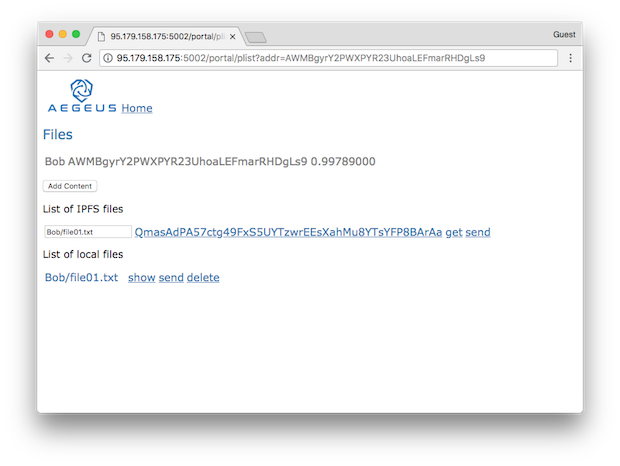

## Welcome to the Aegeus IPFS system

Here we proudly bring you a preview of the Aegeus user interface.

A full walk through of the demo is here: [QmfYfBWv8ePVsGN4Uo6JJHj8n8XmGJf9fAoCjMgmLvhY16](https://ipfs.io/ipfs/QmfYfBWv8ePVsGN4Uo6JJHj8n8XmGJf9fAoCjMgmLvhY16/trail)

### Installing Docker

Currently, this installation requires a working [Docker](https://www.docker.com/community-edition#/download) environment.

To verify that your Docker env is setup properly, you can list the running containers like this ...

    $ docker ps
    CONTAINER ID        IMAGE               COMMAND             CREATED             STATUS              PORTS               NAMES

### The Aegeus images

In total there are four Docker images to make up the complete system.

1. [aegeus/aegeusd](https://hub.docker.com/r/aegeus/aegeusd)
2. [aegeus/aegeus-ipfs](https://hub.docker.com/r/aegeus/aegeus-ipfs)
3. [aegeus/aegeus-jaxrs](https://hub.docker.com/r/aegeus/aegeus-jaxrs)
4. [aegeus/aegeus-webui](https://hub.docker.com/r/aegeus/aegeus-webui)

What follows is an installation guide for all four containers. However, if you already have IPFS and AEG running locally, you will not need to run these in Docker again.
For a mixed setup with already running IPFS & AEG service and newly hosted Docker services go [here](docs/src/markdown/setup/Setup-Mixed-Docker.md).

### Quickstart

Here is the quickstart to get the whole system running in no time ...

    export GATEWAYIP=[YOUR_PUBLIC_IP]
    docker run --detach --name aegd -p 29328:29328 --memory=200m --memory-swap=2g aegeus/aegeusd
    docker run --detach --name ipfs -p 4001:4001 -p 8080:8080 -e GATEWAYIP=$GATEWAYIP --memory=200m --memory-swap=2g aegeus/aegeus-ipfs; sleep 20
    docker run --detach --name jaxrs -p 8081:8081 --link aegd:aeg --link ipfs:ipfs --memory=200m --memory-swap=2g aegeus/aegeus-jaxrs
    docker run --detach --name webui -p 8082:8082 --link aegd:aeg --link ipfs:ipfs --link jaxrs:jaxrs --memory=200m --memory-swap=2g --env AEG_WEBUI_LABEL=Bob aegeus/aegeus-webui

You should now be able to access the WebUI at: [http://127.0.0.1:8082/portal](http://127.0.0.1:8082/portal)

### Updating the installation

Remove all running containers

    docker rm -f `docker ps -aq`

Pull the latest image versions

    docker pull aegeus/aegeusd
    docker pull aegeus/aegeus-ipfs
    docker pull aegeus/aegeus-jaxrs
    docker pull aegeus/aegeus-webui

Then, start again by running these containers.

### Building this project

You can use the standard maven build process, like this

    mvn clean install

However, running the tests will require to have an IPFS and an AEG wallet instance running.
Please follow the instructions for the [mixed setup](docs/src/markdown/setup/Setup-Mixed-Docker.md) to get this going.

Merci
