## Aegeus Prototype

Welcome, I'm glad you made it to this page. 

In this demo we connect to two low cost [VPS](https://www.vultr.com). Each hosting a [Docker](https://www.docker.com/community-edition) environment with three containers.

* AEG-2.0
* IPFS-0.4.15 
* AEG-Prototype

Networking between these containers is isolated by Docker. The prototype records OP_RETURN data on the Aegeus mainnet to provide proof of ownership and encryption capabilies of content stored on IPFS. It was originally developed on the Bitcoin testnet with sufficient abstractions to now also support Aegeus. 
    
Without further ado, lets dive right into what we have here ...

### Bob visits Aegeus 

Our first actor is Bob. He has heard about what [Aegeus](https://aegeus.io) is doing with IPFS and would like to give Mary, who we will meet later, an encrypted copy of his medical records. For ensurance reasons, he needs proof that Mary has been given access to these records by a certain date. Needless to say, he does not want anybody else, but Mary, to be able to access these records.

Bob visits Aegeus here: [http://127.0.0.1:8082/portal](http://127.0.0.1:8082/portal)

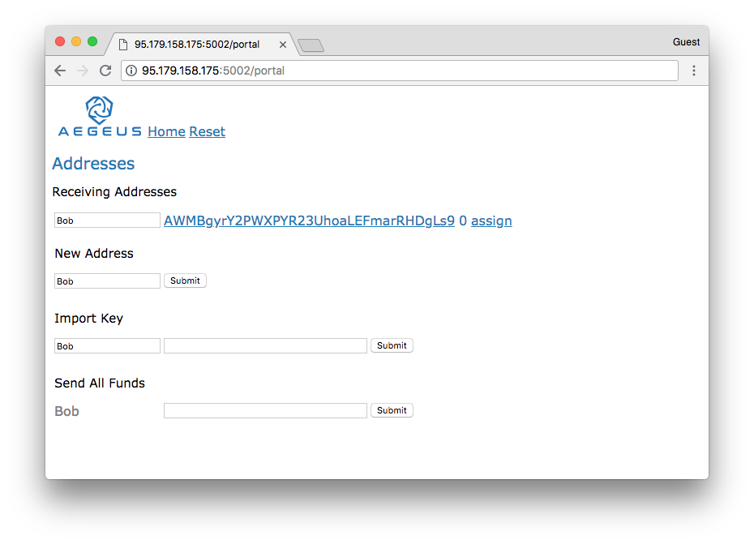

#### Receiving Addresses

Is the list of addresses that Bob's wallet knows about. Initially, we see the single default address that the Aegeus wallet creates on startup. This address has no funds yet and also has no label associated with it. The prototype does not use the wallet's account system because of a plethora of 
[issues](https://github.com/bitcoin-dot-org/bitcoin.org/issues/1287) associated with it. 

#### New Address

Here we could create a new address, but we won't do that just yet. 

#### Import Key

Here we could import an existing private key, instead of transfering funds to the default address. 

#### Send All Funds

When done with the demo we can transfer all remaining funds to where they came from. 

### Bob's address gets assigned a label 

Assign the by clicking on __assign__.

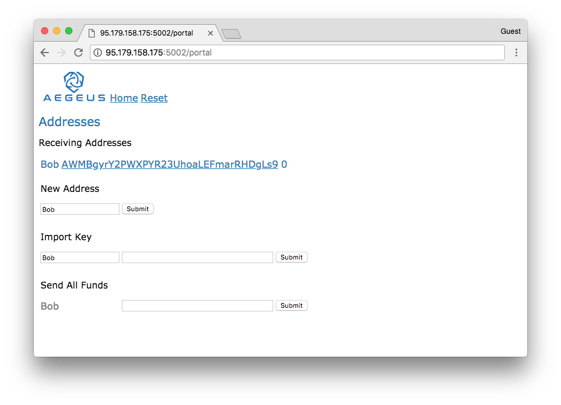
  
### Give Bob some funds

When the prototype records stuff on the blockchain it will have to pay network fees. Other than that there is no further cost involved. 
Hence, giving Bob 1 AEG is plenty for this demo.  
  
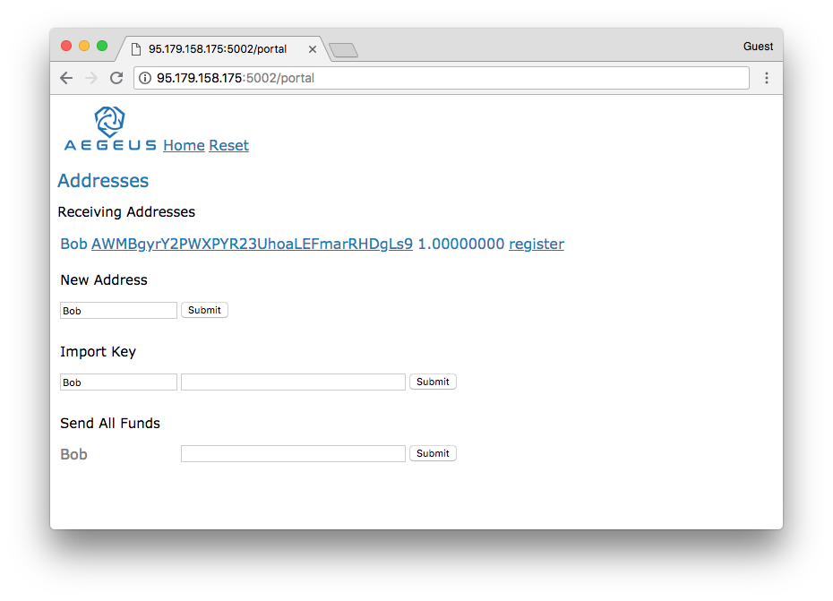
  
### Register Bob's public key

All file content stored on IPFS is encrypted with the owner's bublic key, which we now register on the blockchain so that others can find it. In future, this step may not be needed any more when the Eleptic Curve key pair used for encryption can be derived direcly from Bob's private AEG key.

For now, we register a propriatary public key by clicking on __register__.


We can head over to the Aegeus block exporer and look at Tx: [f3adc68524aa88b1543fd03454b484d3ef4f70900815a49e6b81b1e14aa4af44](https://chainz.cryptoid.info/aeg/tx.dws?f3adc68524aa88b1543fd03454b484d3ef4f70900815a49e6b81b1e14aa4af44.htm) 

### Bob adds his medical records

By clicking on one of Bob's addresses, we come to a page that lists the file content stored on IPFS. At this stage, the list is empty. Please note, that this does actually not query the IPFS network. Instead it queries the blockchain for references to IPFS files associated with this address.

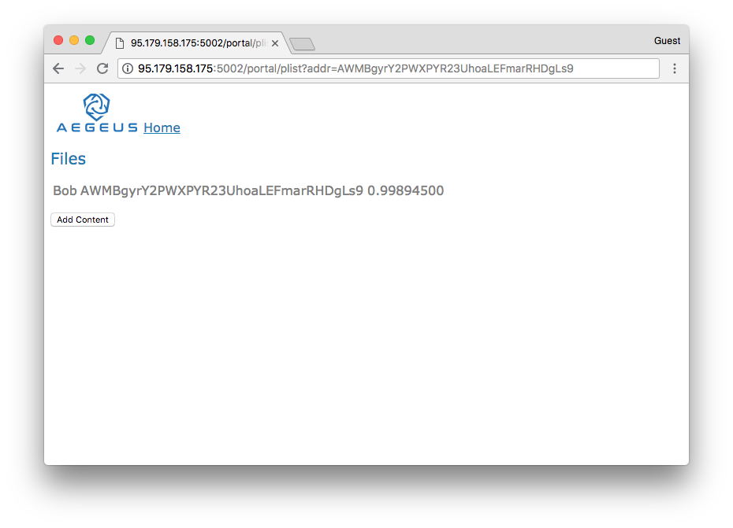

We procede in the obvious way ...

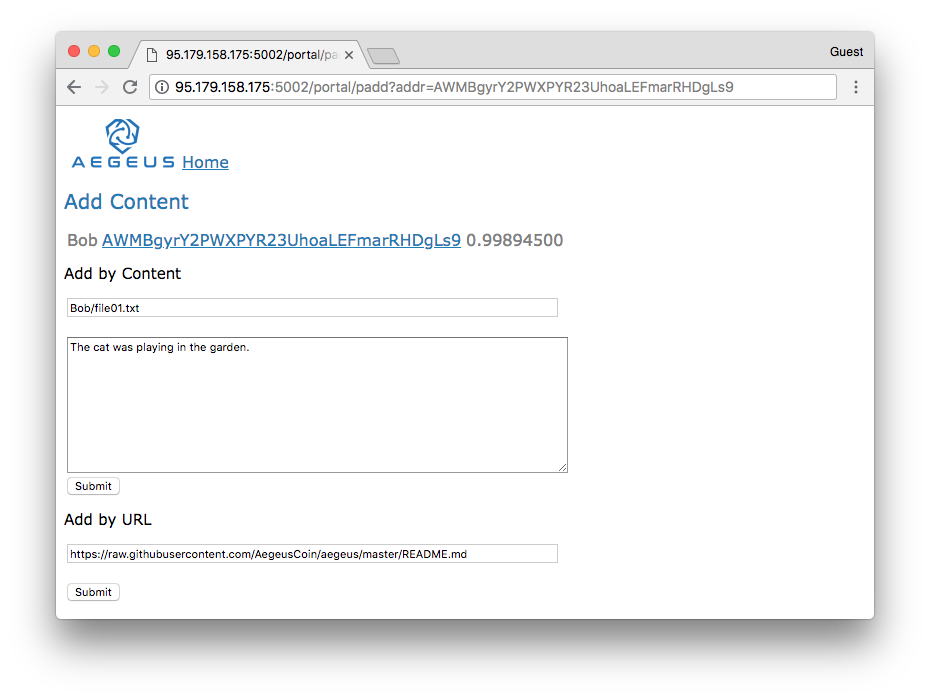

#### Add by Content

Allows us to add some content directly from this page, which we will do by clicking the first __Submit__ button. 

#### Add by URL

Allows us to add some content from an URL. 

### Bob inspects his IPFS content

We are back on the page that lists Bob's IPFS content and voila, we see the IPFS hash that has just been associated with Bob's address.

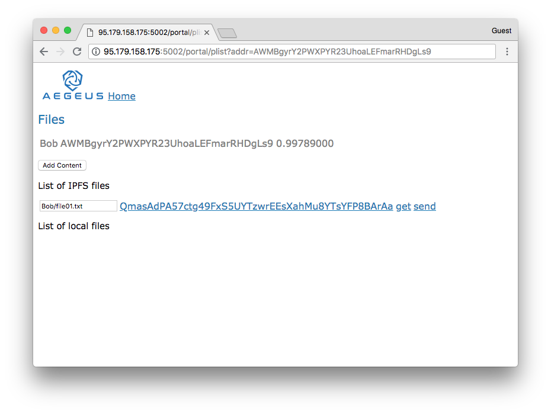

We can now click on the hash to see the encrypted content as it is known to IPFS.

```
AEG-Version: 1.0
Path: Bob/file01.txt
Owner: AWMBgyrY2PWXPYR23UhoaLEFmarRHDgLs9
Token: BAwdzzobxi3Z4Xlu+rSnd4hk8xv8QNVAnuMzXH9D1IBN884jYf3XG21nxhkcjBsJihpEotY6ES1ykJo0xlj+mVj87slr
AEG_HEADER_END
AAAADCl8STWiPCcfCZUsFix0d1UCDOSDZjE/RyL46PLTt0shNmVwOhB08w9A0hxptp4yiZIWABMeA+G8I2p3qA7c
```

### Bob decrypts his medical record

On IPFS file list, we can also __get__ encrypted content from IPFS and save a decrypted copy locally

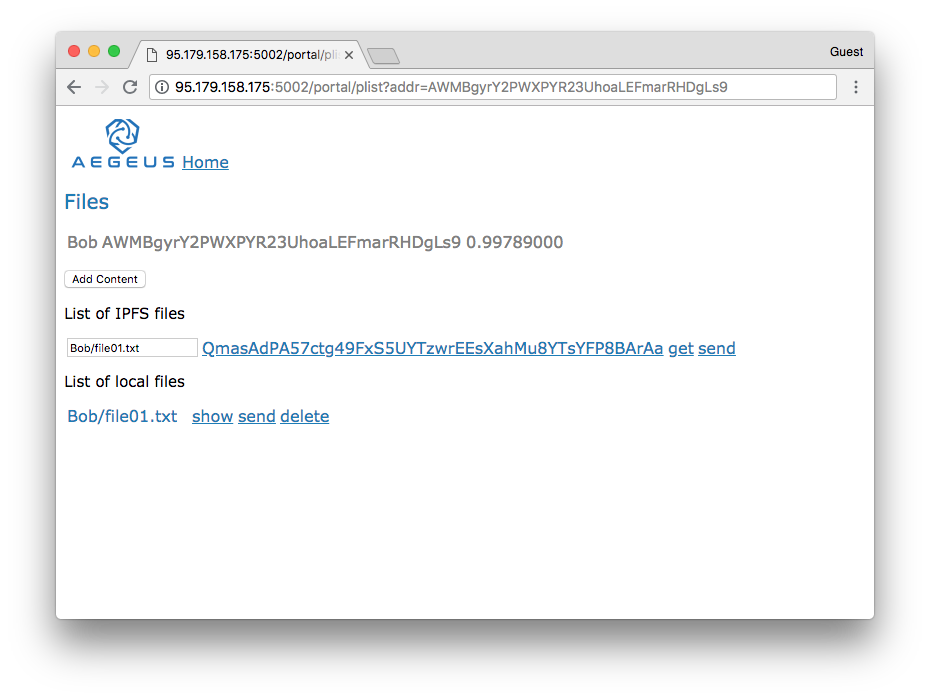

The Aegeus app can then __show__ us the decrypted content.

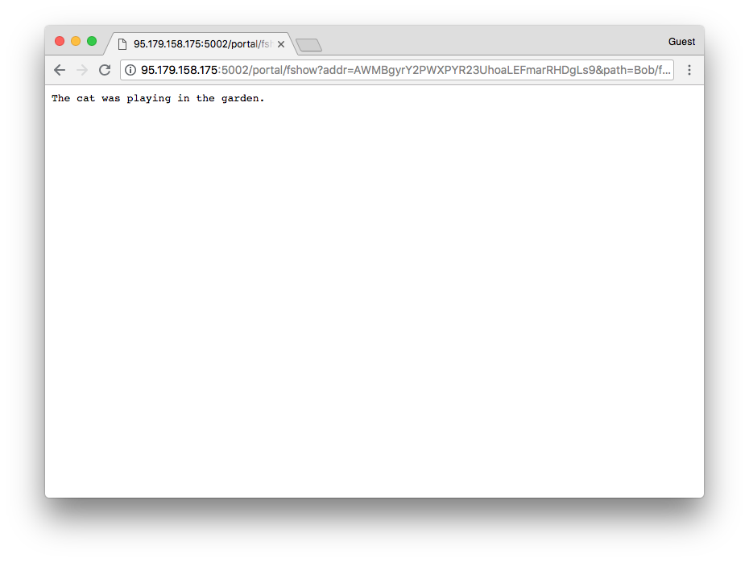

### Mary visits Aegeus

Mary also has access to Aegeus. Like Bob, she has already registered her public key. 

Mary visits Aegeus here: [http://167.99.32.85:8082/portal](http://167.99.32.85:8082/portal)

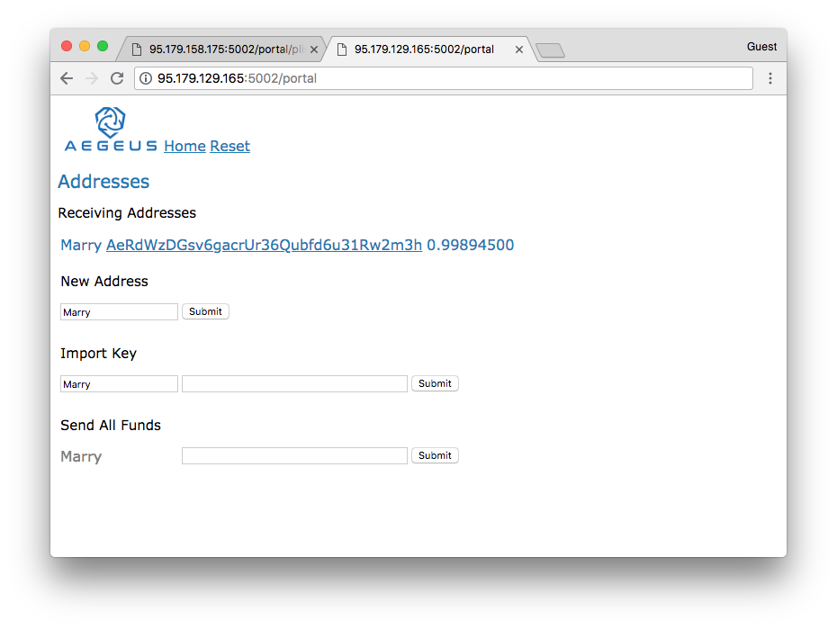

### Bob imports Mary's address

Bob imports Mary's address like this 

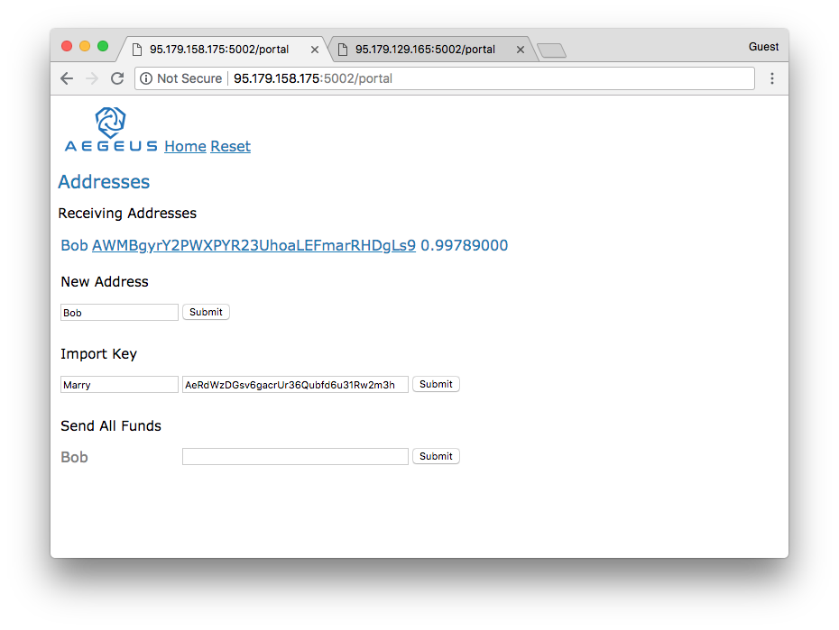

Because Bob does not own Mary's private key, this is a "watch only" address. It allows Bob's wallet to see Mary's transactions - specifically her public encryption key.

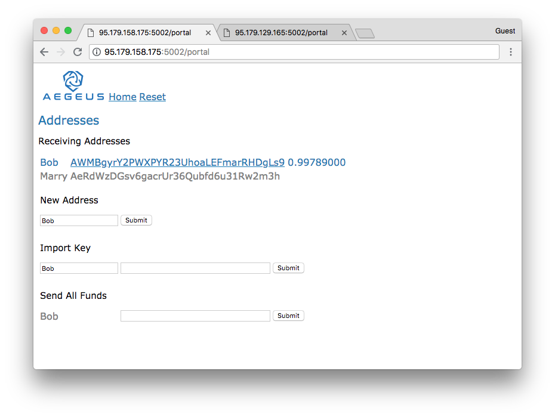

### Bob sends his medical record to Mary

Bob can now head over to his file list and click on __send__.


### Mary gets Bob's medical record

After a while Mary's wallet sees the tranasaction on the Aegeus network and Mary's IPFS node will be able to see the IPFS file.

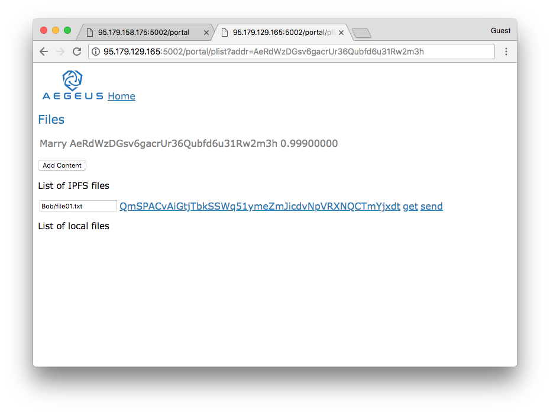

### Mary decrypts Bob's medical record

Mary (and only Mary) can now get/decrypt that IPFS file.

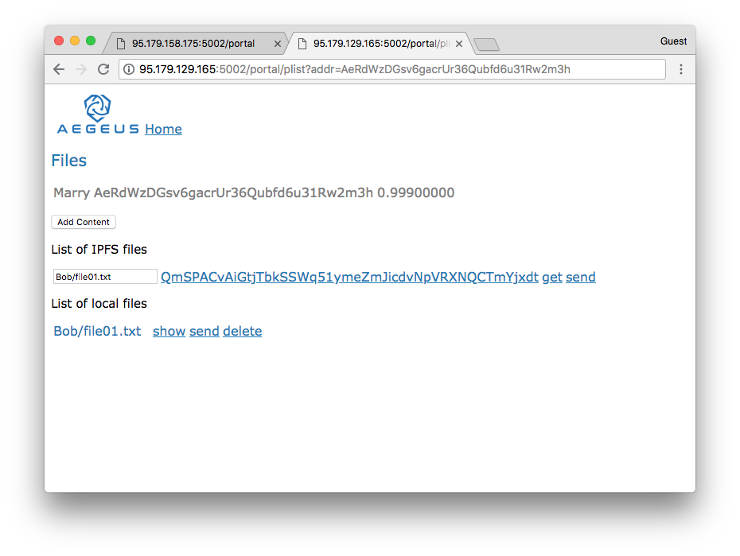

### Mary takes a look at the content

The previous __get__ has first transferred the encrypted file to Mary's local storage and then decrypted it. 
Marr can now click __show__ on the decrypted file to view the content.


### Finally

Thanks for watching this demo, perhaps you liked it. 

If you like to install this on your side, have a look at this [setup guide](Setup-Guide-Bob.md) 
